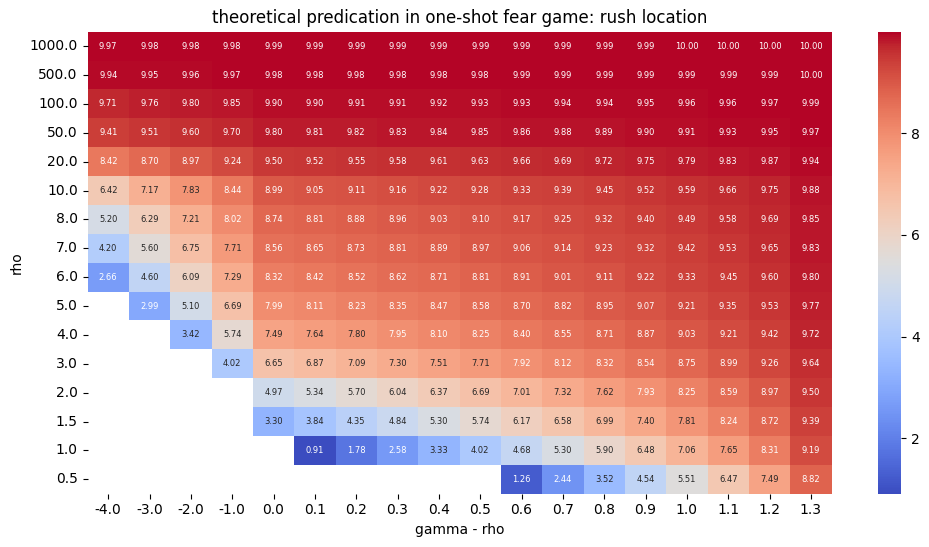
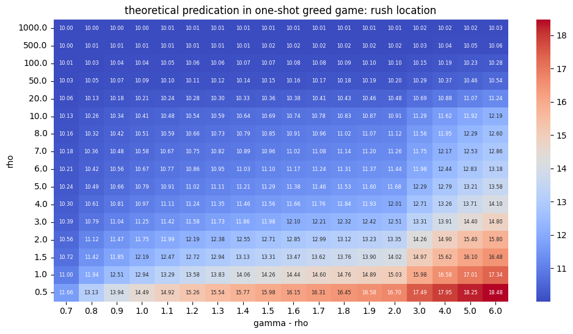
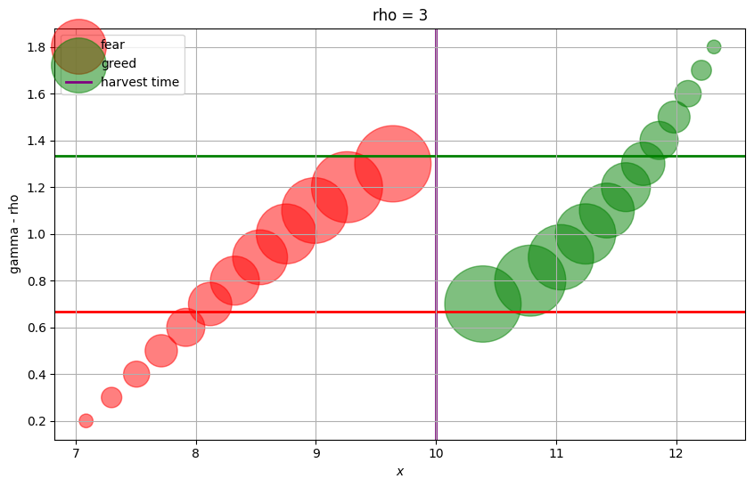
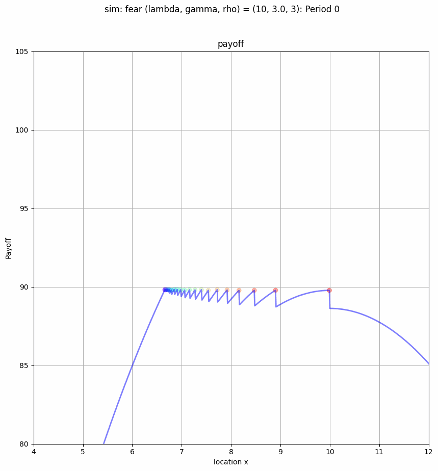
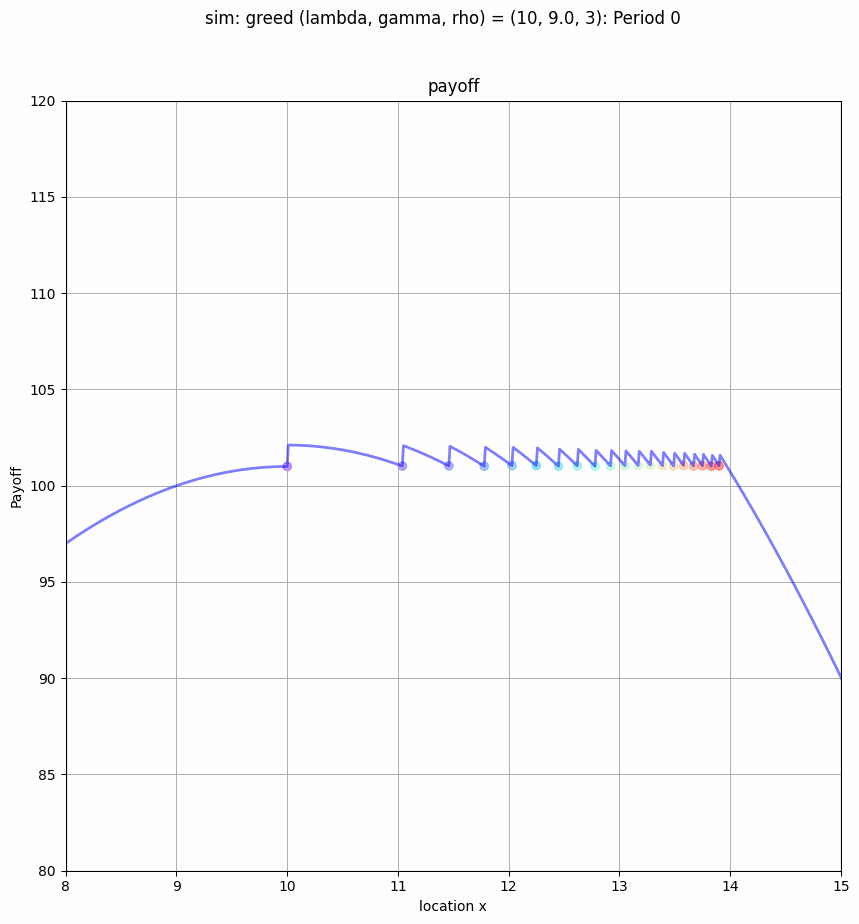
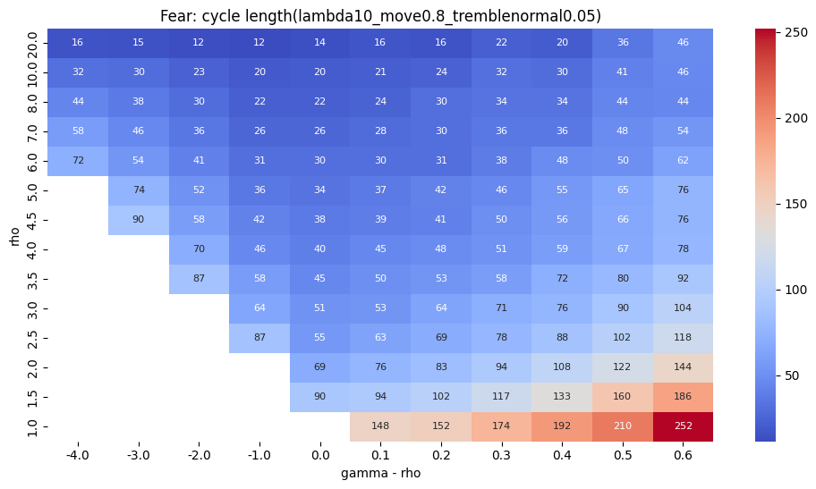
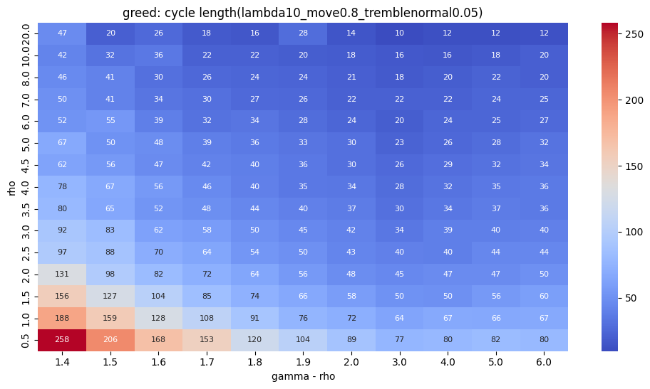
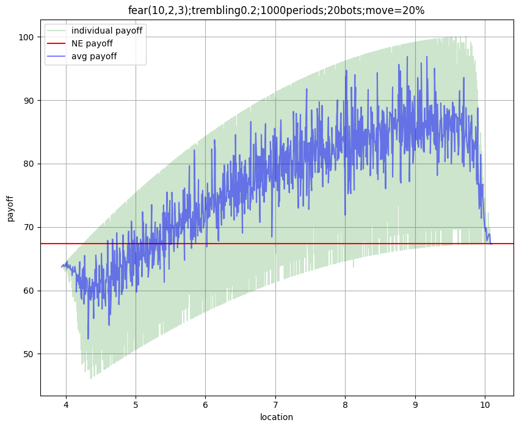
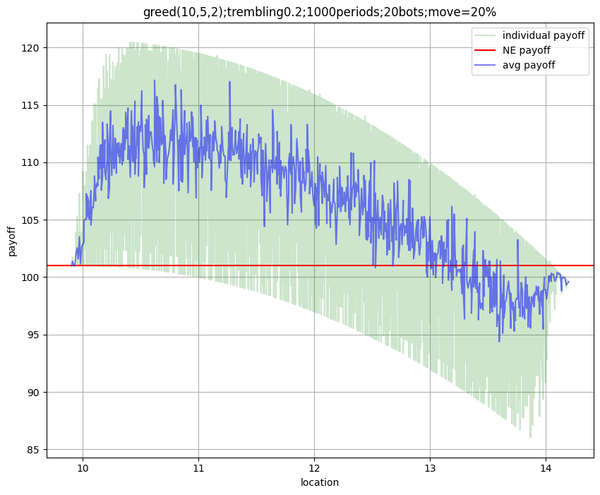

# Timing Games Simulations
## One-shot Game Theoretical Prediction
Fear Game             | Greed Game
:-------------------------:|:-------------------------:
 | 

### Generalize both games
 

## Dynamics Game Predictions
Fear Game             | Greed Game
:-------------------------:|:-------------------------:
 | 
 | 
 | 